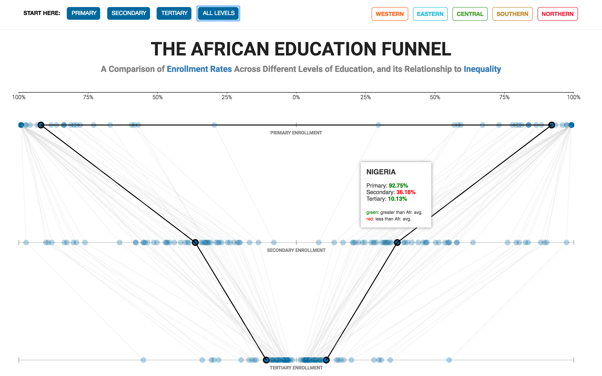

# The African Education Funnel
## A comparison of enrollment rates across different levels of education

#### Description:

Over the past decade, the primary school enrollment rate in 
in sub-Saharan Africa has significantly improved , now averaging over 80%.
However, the poor secondary and tertiary enrollment rates are considerably restricting 
the region from moving it's economy toward higher-productivity sectors.
This visualization is an attempt to establish this gap between the enrollment rates across African countries. 
The enrollment rates displayed below are averaged over the ten year peiod, from 2004 to 2014.
The visualization further explores the change in enrollment rates over time, and compares it 
with the change in the GINI coefficient over the same time period.

#### Research Question:

> I am studying the state of education enrollment in the sub-saharan african countries because I want to find out how the enrollement rates at different levels of education correlate with the resource dependance and productivity in order to understand it's impact on the inequality levels in these countries. I am considering using the [education enrollments rates](http://data.uis.unesco.org/?queryid=142), [resource dependant rates](http://wdi.worldbank.org/table/3.14#) and [productivity rates](http://data.worldbank.org/indicator/NY.GDP.PCAP.CD?end=2015&start=1960) as my variables. My visualization is based on UNESCO Institute of Statistics and World Development Indicators data.

